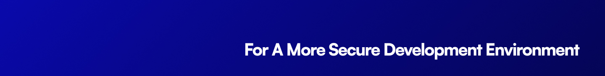

<p align="center"></p>

[![npm version][npm-version-src]][npm-version-href]
[![GitHub Actions][github-actions-src]][github-actions-href]
[](http://commitizen.github.io/cz-cli/)
[![npm downloads][npm-downloads-src]][npm-downloads-href]

# bun-plugin-dotenvx

A powerful loader for your dotenv files, powered by [dotenvx](https://dotenvx.com).

## Features

- **Multi-environment support** - Load different `.env` files for different environments
- **Encrypted envs** - Securely store encrypted environment variables in your codebase
- **Variable expansion** - Reference and expand variables already on your machine
- **Command substitution** - Add the output of a command to your variables
- **Configurable** - Customize the plugin with various options
- Supports a wide variety of `.env` file types
  - `.env`, `.env.local`, `.env.staging`, `.env.production`, `.env.development`, `.env.dev`, `.env.beta` etc.

## Installation

```bash
bun install -d bun-plugin-dotenvx
```

Next, ensure you are preloading the plugin in your `bunfig.toml`:

```toml
preload = [
  "./node_modules/bun-plugin-dotenvx/dist/index.js",
  # ...
]
```

## Basic Usage

You may now use the decrypted `.env` values in your project:

```ts
import env from './.env'

// Accessing environment variables
const apiKey = env.API_KEY
const databaseUrl = env.DATABASE_URL

console.log(`API Key: ${apiKey}`)
console.log(`Database URL: ${databaseUrl}`)
```

## Advanced Usage

### Custom Configuration

You can customize the plugin by creating your own instance with specific options:

```ts
import { plugin } from 'bun'
// plugin.ts
import { createDotenvxPlugin } from 'bun-plugin-dotenvx'

// Create a custom plugin instance
const dotenvxPlugin = createDotenvxPlugin({
  path: ['.env.local', '.env'],
  overload: true,
  strict: true,
  verbose: true,
})

// Register the plugin
await plugin(dotenvxPlugin)
```

Then in your `bunfig.toml`:

```toml
preload = [
  "./plugin.ts",
  # ...
]
```

### Multi-Environment Support

Load different `.env` files for different environments:

```ts
import { plugin } from 'bun'
// development.ts
import { createDotenvxPlugin } from 'bun-plugin-dotenvx'

// production.ts
// import { createDotenvxPlugin } from 'bun-plugin-dotenvx'

await plugin(createDotenvxPlugin({
  path: ['.env.development.local', '.env.development', '.env.local', '.env'],
}))

await plugin(createDotenvxPlugin({
  path: ['.env.production.local', '.env.production', '.env'],
}))
```

### Encrypted Envs

To use encrypted environment variables:

1. First, encrypt your `.env` file using dotenvx:

```bash
npx @dotenvx/dotenvx encrypt
```

2. Then, use the plugin as normal, but make sure to set the `DOTENV_PRIVATE_KEY` environment variable:

```bash
DOTENV_PRIVATE_KEY="your-private-key" bun run your-script.ts
```

### Configuration Options

The plugin supports the following options:

| Option | Type | Default | Description |
|--------|------|---------|-------------|
| `path` | `string \| string[]` | `['.env']` | Path(s) to your env file(s) |
| `overload` | `boolean` | `false` | Override existing env variables |
| `strict` | `boolean` | `false` | Exit with code 1 if any errors are encountered |
| `ignore` | `string[]` | `undefined` | Ignore specific errors |
| `envKeysFile` | `string` | `'.env.keys'` | Path to your .env.keys file |
| `convention` | `'nextjs'` | `undefined` | Load a .env convention |
| `logLevel` | `string` | `'info'` | Set log level |
| `quiet` | `boolean` | `false` | Suppress all output (except errors) |
| `verbose` | `boolean` | `false` | Set log level to verbose |
| `debug` | `boolean` | `false` | Set log level to debug |

## Testing

```bash
bun test
```

## Changelog

Please see our [releases](https://github.com/stacksjs/bun-plugin-dotenvx/releases) page for more information on what has changed recently.

## Contributing

Please review the [Contributing Guide](https://github.com/stacksjs/contributing) for details.

## Community

For help, discussion about best practices, or any other conversation that would benefit from being searchable:

[Discussions on GitHub](https://github.com/stacksjs/stacks/discussions)

For casual chit-chat with others using this package:

[Join the Stacks Discord Server](https://discord.gg/stacksjs)

## Postcardware

“Software that is free, but hopes for a postcard.” We love receiving postcards from around the world showing where `bun-plugin-dotenvx` is being used! We showcase them on our website too.

Our address: Stacks.js, 12665 Village Ln #2306, Playa Vista, CA 90094 🌎

## Sponsors

We would like to extend our thanks to the following sponsors for funding Stacks development. If you are interested in becoming a sponsor, please reach out to us.

- [JetBrains](https://www.jetbrains.com/)
- [The Solana Foundation](https://solana.com/)

## Credits

Many thanks to the following core technologies & people who have contributed to this package:

- [Mot](https://github.com/motdotla) & [dotenv](https://github.com/motdotla/dotenv) & [dotenvx](https://github.com/dotenvx/dotenvx)
- [Chris Breuer](https://github.com/chrisbbreuer)
- [All Contributors](../../contributors)

## License

The MIT License (MIT). Please see [LICENSE](https://github.com/stacksjs/stacks/tree/main/LICENSE.md) for more information.

Made with 💙

<!-- Badges -->
[npm-version-src]: https://img.shields.io/npm/v/bun-plugin-dotenvx?style=flat-square
[npm-version-href]: https://npmjs.com/package/bun-plugin-dotenvx

[npm-downloads-src]: https://img.shields.io/npm/dm/bun-plugin-dotenvx?style=flat-square
[npm-downloads-href]: https://npmjs.com/package/bun-plugin-dotenvx

[github-actions-src]: https://img.shields.io/github/actions/workflow/status/stacksjs/bun-plugin-dotenvx/ci.yml?style=flat-square&branch=main
[github-actions-href]: https://github.com/stacksjs/bun-plugin-dotenvx/actions?query=workflow%3Aci
